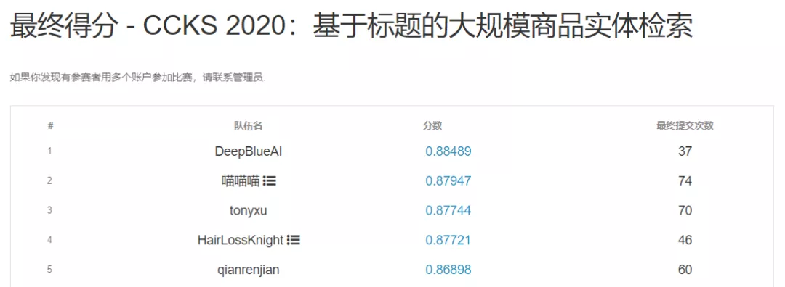
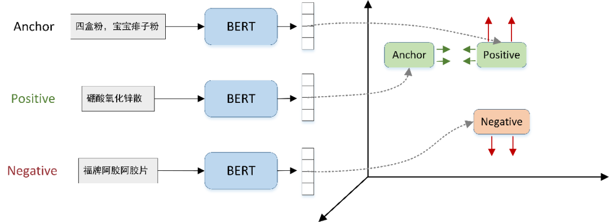
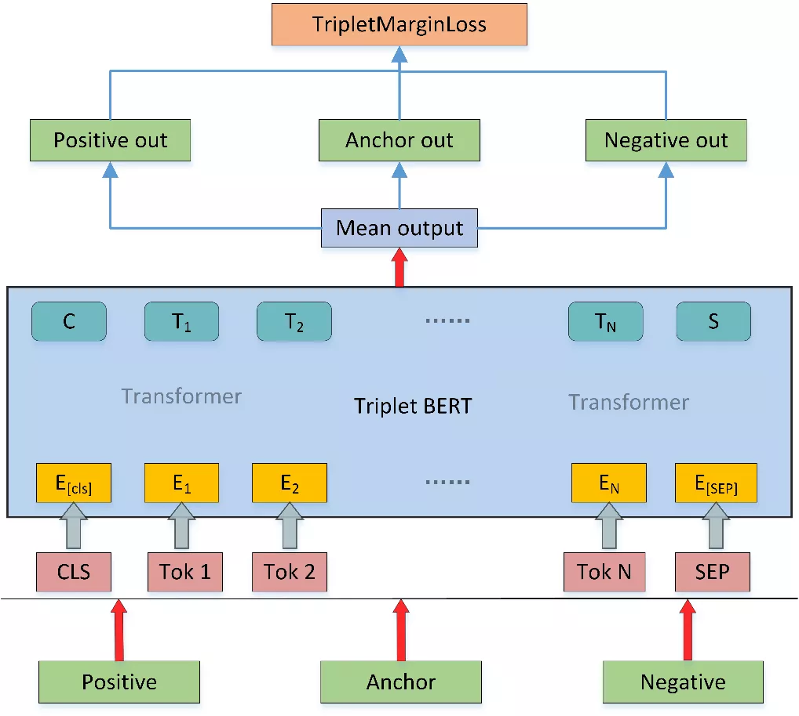
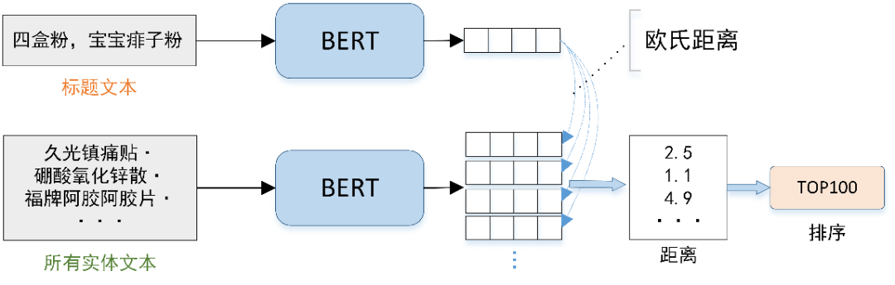
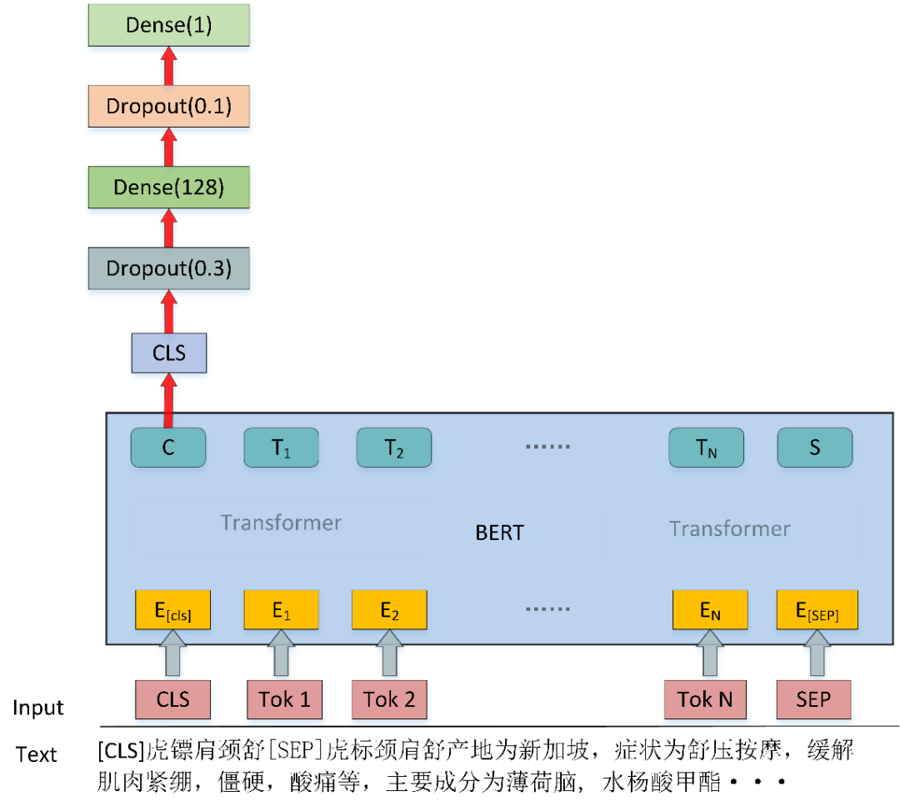

# -
基于标题的大规模商品实体检索top1


一、任务介绍

CCKS 2020：基于标题的大规模商品实体检索，任务为对于给定的一个商品标题，参赛系统需要匹配到该标题在给定商品库中的对应商品实体。

输入：输入文件包括若干行商品标题。

输出：输出文本每一行包括此标题对应的商品实体，即给定知识库中商品 ID，只返回最相关的 1 个结果。

团队成绩：评价方式采用准确率，最终成绩排名如下，DeepBlueAI 团队获得了本任务的冠军以及技术创新奖。

{:height="50px" width="200px"}

比赛难点：基于标题的大规模商品实体检索存在如下几点挑战：

（1）输入文本中可能无法识别出实体指代词； 
（2）商品标题中存在很多变异指代，没有给定的指代映射表； 
（3）商品标题一般较短，上下文语境不丰富，须对上下文语境进行精准理解。

二、引言

基于标题的大规模商品实体检索与实体链接任务类似，都需要找到知识库中对应实体，因为部分标题文本不能识别出实体指代词，并且存在很多变异指代词，所以没有办法使用实体链接那种实体识别 -> 候选实体生成 ->实体消歧的方案。

所以如标题描述一样，DeepBlueAI 团队将该任务定义为信息检索任务，针对检索任务采用了召回 -> 粗排序 -> 精排序的方案。具体而言，首先采用 Triplet BERT 召回模型，召回前 100 最相关实体，然后采用 BERT[1]二分类模型进行粗排序得到前 10 个最相关实体，最后经过精排序得到 1 个最相关实体。

三、数据处理

数据分为 8.3w 训练集文本和包含 text_id，text，implicit_entity 等字段，具体格式如下：
```markdown
{   
  "text_id": 81228,   "text": "四盒粉，宝宝痱子粉",   
  "implicit_entity": [{"subject": "硼酸氧化锌散", "subject_id": 23813}]
 }
``````

知识库数据 27.7w 商品实体，其中药品类 4.4k 个和书籍类 27.3w 个，知识库商品实体包含实体类型、实体 ID、实体 predicate 和 object 项，具体格式如下：
```markdown
{
   "type": "Medical",
   "subject_id": 23813,    
   "subject": "硼酸氧化锌散",    
   "data": [   
      {"predicate": "生产企业", "object": "中国医科大学附属盛京医院"},       
      {"predicate": "主要成分", "object": "本品为复方制剂。其组分为：每盒含氧化锌 12.5g、硼酸 12.5g"},      
      {"predicate": "症状", "object": "本品具有收敛、止痒、吸湿、杀菌作用。用于预防和治疗成人和婴幼 儿各种原因引起的痱子。"},      
      {"predicate": "规格", "object": "50g"},       
      {"predicate": "产地", "object": "中国"}]
}
``````
因为官方提供的数据是从实际业务场景得到，并没有进行清洗，所以原始数据存在太多的噪音，其中影响模型性能的情况如下：

图书类别太多

因为训练集中图书类别的标题占比很少，几乎可以忽略不计，但是在知识库中却占据了 98%，经过试验分析后去掉了训练集和知识库数据中图书类别的数据。

训练集中 text_id 不唯一

在多数情况下大家会默认 text_id 是唯一的，但是发现官方提供的 text_id 并不是唯一的，如果利用 text_id 唯一性去实现相关代码则会导致标注错误等情况。

相同标题文本对应多个实体 ID

训练集存在一些数据，标题文本相同但是对应的实体 ID 却不同，这类数据分为三种情况：

标题文本不包含任何实体信息
```markdown
{"text_id": 22473, "text": "药品", "implicit_entity": [{"subject": "丁苯羟酸乳膏", "subject_id": 268655}]}
{"text_id": 105526, "text": "药品", "implicit_entity": [{"subject": "肿节风软胶囊", "subject_id": 53176}]}
``````
标题文本对应的两个实体都具有关系
```markdown
{"text_id": 134542, "text": "正品米菲司同片铜片", "implicit_entity": [{"subject": "米菲司酮片", "subject_id": 140181}]}
{"text_id": 21246, "text": "正品米菲司同片铜片", "implicit_entity": [{"subject": "司米安米非司酮片", "subject_id": 134662}]}
``````
标题文本对应的两个实体一个为正确标注另一个为错误标注
```markdown
{"text_id": 132115, "text": "阿达帕林", "implicit_entity": [{"subject": "福牌阿胶阿胶片", "subject_id": 216530}]}
{"text_id": 45692, "text": "阿达帕林", "implicit_entity": [{"subject": "维 A 酸乳膏", "subject_id": 230257}]}
``````
上述相同标题文本对应多个实体 ID 的情况会在最后的排序阶段影响模型的收敛，导致最后的性能下降，所以直接删除了这部分数据。

相似实体

知识库中存在一些极其相似的实体，例如下面的两个实体只有生成企业不同，其他完全相同。针对这种相似的实体，团队会保留在训练集中出现的那一个，其他的全部删除。
```markdown
{"type": "Medical", "subject_id": 172360, "subject": "肾石通颗粒", "data": [{"predicate": "生产企业", "object": "河北万岁药业有限公司"}, {"predicate": "主要成分", "object": "金钱草、王不留行（炒）、萹蓄、延胡索（醋制）、鸡内金(烫)、丹参、木香、瞿麦、牛膝、海金沙。"}, {"predicate": "症状", "object": null}, {"predicate": "规格", "object": ["15g*10 袋(万岁)"]}, {"predicate": "功能", "object": null}]}

{"type": "Medical", "subject_id": 31946, "subject": "肾石通颗粒", "data": [{"predicate": "生产企业", "object": "修正药业集团股份有限公司"}, {"predicate": "主要成分", "object": "金钱草、王不留行（炒）、萹蓄、延胡索（醋制）、鸡内金（烫）、丹参、木香、瞿麦、牛膝、海金沙。"}, {"predicate": "症状", "object": null}, {"predicate": "规格", "object": ["15g*10 袋(修正)"]}, {"predicate": "功能", "object": null}]}
``````
实体描述文本构建

知识库中的数据为结构化数据，需要将结构化数据变成文本，所以按照 ['产地', '功能', '症状', '主要成分', '生产企业', '规格'] 的顺序对知识库中的结构化文本相连得到商品实体的描述文本。经实验分析，“产地”、“功能”对结果影响较大，放在了前面，而 “生产企业”、“规格” 影响较少，放在了后面。对于上述 “硼酸氧化锌散” 的例子构建的描述文本为：

硼酸氧化锌散的产地为中国，症状为本品具有收敛、止痒、吸湿、杀菌作用。用于预防和治疗成人和婴幼 儿各种原因引起的痱子。主要成分为本品为复方制剂。其组分为：每盒含氧化锌 12.5g、硼酸 12.5g，生产企业为中国医科大学附属盛京医院，规格为 50g

四、召回模型

针对每个标题文本需要从知识库找到对应的那一个商品实体，虽然经过上述的处理剩了 4000 左右的实体，但是如果直接采用 Interaction-Based（交互型，即标题和实体描述文本在模型中存在信息交互） 类型的网络，计算量将巨大。对于 8w 的训练集，则过一遍有 3.2 亿的计算量，因此交互型网络在召回阶段无法使用，可以在后续排序阶段使用。

因此传统的文本召回方式如 TF-IDF、BM25 等基于传统特征的召回方式不适用于当前数据集，而基于深度学习的召回网络如 DSSM[2]、CLSM[3]等仅仅使用了静态的词向量，而商品标题一般较短，上下文语境不丰富，必须对上下文语境进行精准理解，所以此类模型效果依旧不行。

最终团队决定采用基于预训练模型 BERT 的排序模型进行召回，模型依据 Sentence-Bert[4]，采用 triplet network[5]形式，loss 为 Triplet loss，模型共用同一个 BERT 层。

Triplet loss

Triplet loss 输入样本对是一个三元组，这个三元组图片由一个锚点样本图片、一个正样本图片和一个负样本图片组成。其目标是锚点样本与负样本之间的距离图片与锚点样本和正样本之间的距离图片之差大于一个阈值图片，可以表示为：


对于简单容易学习的样本图片，这种对比起正样本来说，负样本和锚点样本已经有足够的距离了（即是大于 m ），此时 loss 为 0，网络参数将不会继续更新，对于其他样本 loss>0 网络参数可以正常更新。

针对此任务，如下图 1 所示，锚点（Anchor）样本为标题文本，正样本（Positive）为标题对应的实体描述文本，负样本（Negative）为其他随机选择与正样本不同的实体描述文本，团队采用了 Pytorch 中 TripletMarginLoss 类作为实验方式，为了让模型达到最优效果，将 margin 参数设置为 3（默认为 1）。


图 1：Triplet loss

具体的召回模型图如下图 2 所示，Anchor 为商品标题，Positive 为正样本的实体描述文本，Negative 为负样本的实体描述文本，其中这三个输入共享一套 BERT 模型参数。训练时将上述三个文本输入到 BERT 模型中，选取 BERT 模型的所有 Token 向量平均作为输出，将三个输入向量经过 TripletMarginLoss 得到损失值完成模型的训练。负样本选择上采用动态负采样，在训练中的每个批次（batch）中，都对三元组进行动态的采样样本。


图 2：Triplet BERT

模型推理

推理阶段如下图 3 所示，将所有标题文本和所有实体描述文本都经过 BERT 模型得到向量表征，然后对于某一个标题文本的向量和所有实体描述文本的向量进行距离度量，其中采用欧式距离作为度量方式，选择距离最近的 Top100，得到了该标题文本的前 100 个召回实体。

通过交叉验证对训练集进行预测，得到训练集每个标题的前 100 个召回实体。对于测试集则采用了概率求平均进行模型的融合。其中 BERT 模型采用了两种预训练，分别是 ernie-1.0[6]和 roberta-wwm[7] 。对于两个模型预测的结果也是采用了取平均的方式，在训练集上召回覆盖率达到 98.6%。


图 3：召回推理

五、排序模型

排序分为两个阶段，分别是由 top100 排序得到 top10，再由 top10 排序得到 top1。每个标题的对应实体的 top100 由前面召回模型得到，在 top100 的基础上构建粗排序模型，由粗排序模型得到 top10，然后在 top10 的基础上构建精排序模型。


图 4：排序模型图

排序模型采用了基于二分类的排序方法，模型如上图 4 所示，模型将标题文本和实体描述文本连在一起输入到模型中，最后选取 CLS 位置的向量输出进行二分类，然后对输出的概率排序，完成实体的排序。

模型输入有标题文本和实体描述文本构成，如：
```markdown
标题文本：虎镖肩颈舒
实体描述文本：虎标颈肩舒产地为新加坡，症状为舒压按摩，缓解肌肉紧绷，僵硬，酸痛等，主要成分为薄荷脑, 水杨酸甲酯
``````
将上述两段文本连在一起为：
```markdown
[CLS]虎镖肩颈舒 [SEP] 虎标颈肩舒产地为新加坡，症状为舒压按摩，缓解肌肉紧绷，僵硬，酸痛等，主要成分为薄荷脑, 水杨酸甲酯[SEP]
``````
将上述文本输入到 BERT 模型进行二分类，得到该标题与该实体的概率。

top100 -> top10

根据前面召回模型得到 top100，在此基础上构建排序模型，负样本选择依旧采用动态负采样。每个 Batch 在 top100 中选取 3 个与正样本不同的样本作为负样本，也就是当前 Batch 内每个标题文本都对应有一个正样本和 3 个负样本。

预训练模型依然采用了 ernie-1.0 和 roberta-wwm 这两个模型，然后采用交叉验证得到训练集中每个标题对应的 top10 文本，对于测试集则采用对概率求平均的方式融合。在划分的验证集上 top100 -> top10 的覆盖率达到 93% 左右。

top10 -> top1

top10 -> top1 和 top100 -> top10 训练方式一样，负采样格式改成 2，对测试集采用了 ernie-1.0、roberta-wwm 和 bert-wwt 三个模型并进行了融合。在划分的验证集上最后的准确率达到 83% 左右。

六、结果与总结

采用上述方案，DeepBlueAI 团队在最终的测试集上达到了 88.489 的准确率，对比后几名有着很大的领先，证明了方案的有效性。

上述模型采用 bert-base 版本，速度较慢，所以也在 bert-tiny（3 层的 roberta）上进行过实验，比 base 大概低 2 分左右，但是速度提升很快。在实际应用中可以尝试使用 bert-tiny，这样也能达到一个很好的效果。或者针对数据蒸馏出一个比 bert-tiny 效果更好的小模型，这也是一种可行的方案。
```markdown
参考文献
[1] Devlin J, Chang M W, Lee K, et al. BERT: Pre-training of Deep Bidirectional Transformers for Language Understanding[J]. 2018.
[2] Huang, Po-Sen, et al. "Learning deep structured semantic models for web search using clickthrough data." Proceedings of the 22nd ACM international conference on Information & Knowledge Management. 2013.
[3] Shen, Yelong, et al. "A latent semantic model with convolutional-pooling structure for information retrieval." Proceedings of the 23rd ACM international conference on conference on information and knowledge management. 2014.
[4] Reimers, Nils, and Iryna Gurevych. "Sentence-bert: Sentence embeddings using siamese bert-networks." arXiv preprint arXiv:1908.10084 (2019).
[5] Schroff, Florian, Dmitry Kalenichenko, and James Philbin. "Facenet: A unified embedding for face recognition and clustering." Proceedings of the IEEE conference on computer vision and pattern recognition. 2015.
[6] Sun, Yu, et al. "Ernie: Enhanced representation through knowledge integration." arXiv preprint arXiv:1904.09223 (2019).
[7] Cui, Yiming, et al. "Revisiting Pre-Trained Models for Chinese Natural Language Processing." arXiv preprint arXiv:2004.13922 (2020).
``````
